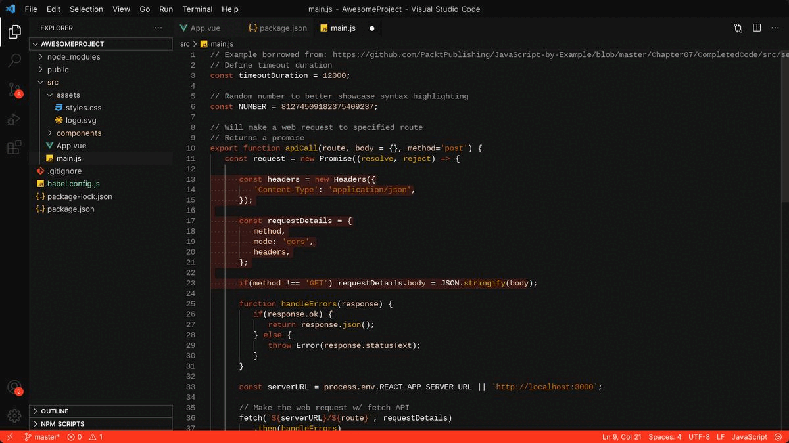

<h1 align="center">AceKaizen Code Theme</h1>
<p align="center">
  
</p>

<p align="center">
  A dark vs-code theme made specially for coding purposes. This theme emphasizes on readability and code clarity. It is a dark theme with a black and orange gradients.
<p>

---

<h2> Theme Snapshots </h2>

<p align="center">
  
</p>

---

<!-- <h2> Installation </h2>

<p> You can install this theme from the <a href="https://marketplace.visualstudio.com/items?itemName=acekaizen.acekaizen-code-theme">Visual Studio Marketplace</a> </p>

--- -->

<h2> Changes </h2>

1. To make changes to the theme, you can clone this repository.

```bash
git clone https://github.com/aryankashyap7/AceKaizen-Code-Theme.git
```

2.  Then, open the repository in your vs-code editor and open the `acekaizen-code-theme` folder.

3.  Press `F5` to load the theme in a new vs-code window.

4.  You can make changes to the `acekaizen-code-theme.json` file and then reload the vs-code editor.

5.  You can also use the `Developer: Inspect Editor Tokens and Scopes` command to inspect the tokens and scopes.

---

<h2> License </h2>

<p> This project is licensed under the MIT License - see the <a href=./LICENSE> LICENSE </a> file for details </p>
